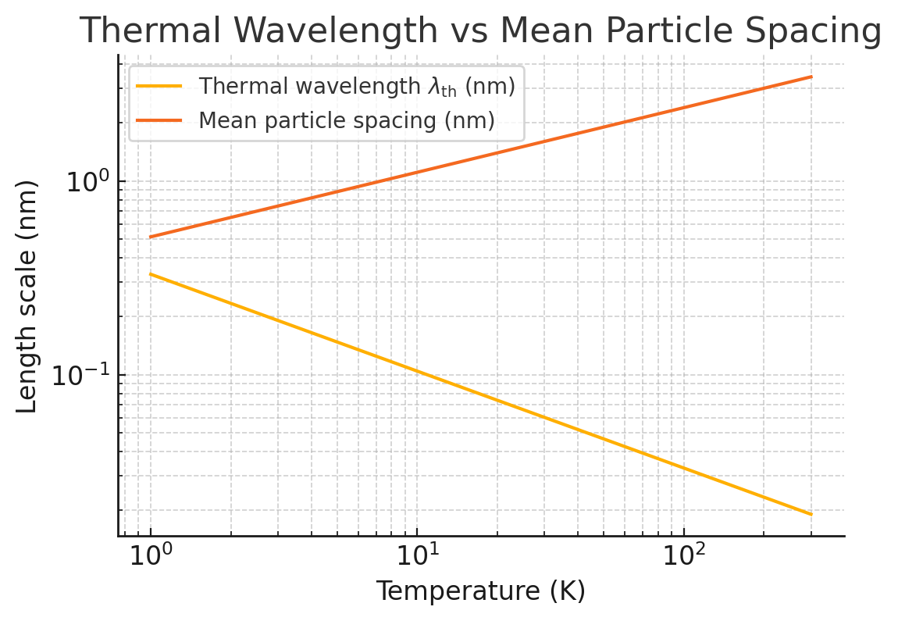

**Author:** Todd R. Story  
**Date Created:** 2025-08-12  
**Last Modified:** 2025-08-12  
**Description:** Derivation of the canonical (N,V,T) partition function for a classical monatomic ideal gas, followed by the NPT (isothermal–isobaric) ensemble and its connection to Gibbs free energy and chemical potential.  
**Keywords:** statistical mechanics, partition function, ideal gas, canonical ensemble, NPT, thermal wavelength

© 2025 Todd R. Story — All rights reserved.  
Unauthorized copying or distribution of this document, in whole or in part, is prohibited without prior written permission.

# Partition Function of a Classical Ideal Gas (N,V,T)

We derive the canonical partition function $Z(N,V,T)$ for a monatomic classical ideal gas.

## Setup (Canonical Ensemble)

- Fixed: particle number $N$, volume $V$, temperature $T$.  
- Classical canonical partition function:

$$
Z(N,V,T) = \frac{1}{h^{3N}N!} \int d^{3N}q\, d^{3N}p\; \exp\!\big[-\beta H(p,q)\big],
\qquad \beta \equiv \frac{1}{k_B T}
\label{igpf:eq:canonical_partition_function}
$$

Where:

- **$Z$** is the canonical partition function.  
- **$N$** is the number of particles.  
- **$h$** is Planck’s constant.  
- **$3N$** represents the 3 spatial dimensions for each of the $N$ particles.  
- **$q$** represents the generalized position coordinates of the particles.  
- **$p$** represents the generalized momentum coordinates of the particles.  
- **$d^{3N}q$** is the differential volume element in configuration space, representing the integral over all possible positions.  
- **$d^{3N}p$** is the differential volume element in momentum space, representing the integral over all possible momenta.  
- **$H(q,p)$** is the Hamiltonian of the system, representing the total energy of the system as a function of its positions and momenta.  
- **$e^{-\beta H(q,p)}$** is the Boltzmann factor, which gives the relative probability of a system being in a particular microstate with energy $H(q,p)$ at temperature $T$.  
- **$\beta = 1/k_B T$** is the inverse temperature, where $k_B$ is the Boltzmann constant.  

## Key aspects of the integral form

- **Phase Space:** The integral is taken over the entire phase space of the system, which is a $6N$-dimensional space defined by the $3N$ position coordinates and $3N$ momentum coordinates of all the particles.  
- **Indistinguishability:** The factor of $1/N!$ accounts for the indistinguishability of the particles, preventing overcounting of microstates when they are identical.  
- **Normalization:** The factor of $1/h^{3N}$ arises from quantum mechanics and accounts for the quantization of phase space, ensuring the partition function is dimensionless.  
- **Why $h$ appears:** The product $d^{3N}q\,d^{3N}p$ has units of $(\text{length}\times\text{momentum})^{3N} = (\text{action})^{3N}$. Dividing by $h^{3N}$ measures the phase–space volume in units of the smallest “quantum cell” allowed by the Heisenberg uncertainty principle ($\Delta x\,\Delta p \gtrsim h$). This makes $Z$ dimensionless and consistent with the quantum limit. The choice of $h$ rather than $\hbar$ is historical and works neatly with the Gaussian momentum integration in the classical limit.  
- **Boltzmann Factor:** The exponential term, containing the Hamiltonian and the inverse temperature, ensures that states with lower energy have a higher probability of being occupied.  

By evaluating this integral, one can determine the canonical partition function and subsequently calculate various thermodynamic properties of the system, including average energy, Helmholtz free energy, entropy, and pressure.

For an **ideal gas**, the Hamiltonian has no potential term:

$$
H(p,q) = \sum_{i=1}^{N} \frac{\mathbf p_i^2}{2m}
\label{igpf:eq:ideal_gas_hamiltonian}
$$

so the integrand in \eqref{igpf:eq:canonical_partition_function} is independent of the positions $q$.

## Position Integral

The configuration integral factorizes:

$$
\int d^{3N}q = \left(\int_V d^3q\right)^{\!N} = V^{N}
\label{igpf:eq:position_integral}
$$

## Momentum Integral

The momentum integral also factorizes:

$$
\int d^{3N}p\, e^{-\beta \sum_i \mathbf p_i^2/2m}
= \prod_{i=1}^{N}\left(\int d^{3}p_i\, e^{-\beta \mathbf p_i^2/2m}\right)
= \left[\int d^{3}p\, e^{-\beta p^2/2m}\right]^{\!N}
\label{igpf:eq:momentum_integral_factorization}
$$

In spherical momentum coordinates:

$$
d^3p = p^2 \sin\theta \; dp \; d\theta \; d\phi
\label{igpf:eq:momentum_volume_element}
$$

so:

$$
\int d^{3}p\, e^{-\beta p^2/2m}
= 4\pi \int_{0}^{\infty} p^{2} e^{-\beta p^{2}/2m}\, dp
= (2\pi m k_B T)^{3/2}
\label{igpf:eq:momentum_integral_result}
$$

## Assemble $Z$ and Define the Thermal Wavelength

Combining \eqref{igpf:eq:position_integral} and \eqref{igpf:eq:momentum_integral_result} into \eqref{igpf:eq:canonical_partition_function}:

$$
Z(N,V,T) = \frac{1}{h^{3N}N!}\, V^{N}\, \big(2\pi m k_B T\big)^{3N/2}
\label{igpf:eq:ideal_gas_partition_pre_lambda}
$$

Introduce the (de Broglie) **thermal wavelength**:

$$
\Lambda \;\equiv\; \frac{h}{\sqrt{2\pi m k_B T}}
\label{igpf:eq:thermal_wavelength}
$$

to obtain the standard compact form:

$$
\boxed{
Z(N,V,T) = \frac{1}{N!}\left(\frac{V}{\Lambda^{3}}\right)^{N}
}
\label{igpf:eq:ideal_gas_partition_final}
$$

## Consistency Checks

- **Dimensionless:** $Z$ is unitless because the phase–space measure $d^{3N}q\,d^{3N}p$ is scaled by $h^{3N}$.  
- **Extensivity:** $\ln Z \sim N$, giving $F=-k_BT\ln Z$ extensive.  
- **Ideal-gas law:** $P = -\left(\partial F/\partial V\right)_{T,N} = N k_BT / V$.  
- **Internal energy:** $U = -\partial \ln Z/\partial \beta = \tfrac{3}{2}N k_B T$ (monatomic).  

*Notes:*  
1) The classical expression assumes $n\Lambda^{3} \ll 1$ (non-degenerate gas).  
2) Quantum statistics (Bose/Fermi) replace the $1/N!$ Gibbs factor with (anti)symmetrization when degeneracy matters.

# NPT Ensemble (Isothermal–Isobaric) for the Ideal Gas

Here we construct the NPT partition function $\Delta(N,P,T)$ two ways and connect it to the Gibbs free energy $G$ and the chemical potential $\mu$.

## Route A: Laplace Transform of $Z(N,V,T)$

Allow $V$ to fluctuate while $P$ and $T$ are fixed:

$$
\Delta(N,P,T) \;=\; \int_{0}^{\infty} dV \; e^{-\beta P V} \; Z(N,V,T)
\label{nptpf:eq:laplace_def}
$$

Using \eqref{igpf:eq:ideal_gas_partition_final}:

$$
\Delta(N,P,T) \;=\; \frac{1}{N!\,\Lambda^{3N}}
\int_{0}^{\infty} dV \; V^{N} e^{-\beta P V}
\label{nptpf:eq:laplace_with_Z}
$$

The integral is $\Gamma(N+1)/(\beta P)^{N+1}=N!/(\beta P)^{N+1}$, yielding:

$$
\boxed{
\Delta(N,P,T) \;=\; \frac{1}{\Lambda^{3N}}\;\frac{1}{(\beta P)^{\,N+1}}
}
\label{nptpf:eq:npt_partition_final}
$$

(For large $N$, the $+1$ in the exponent is negligible in thermodynamic derivatives, but it is exact for the integral.)

## Route B: Direct NPT Definition (with $e^{-\beta P V}$ in the integrand)

Start from the classical phase-space integral and integrate over $V$ as a variable with mechanical weighting:

$$
\Delta(N,P,T) \;=\; \frac{1}{h^{3N}N!}
\int_{0}^{\infty} dV \int d^{3N}q \int d^{3N}p \;
\exp\!\Big[-\beta\!\Big(\sum_{i=1}^N\frac{\mathbf p_i^2}{2m} + P V\Big)\Big]
\label{nptpf:eq:direct_def}
$$

The $q$-integral gives $V^N$ (as in \eqref{igpf:eq:position_integral}), the $p$-integral gives $(2\pi m k_BT)^{3N/2}$ (as in \eqref{igpf:eq:momentum_integral_result}), and the remaining $V$-integral matches \eqref{nptpf:eq:laplace_with_Z}, reproducing \eqref{nptpf:eq:npt_partition_final}.

## Gibbs Free Energy and the Saddle-Point Link to $F$

Define:

$$
G(N,P,T) \;=\; -k_B T \ln \Delta(N,P,T)
\label{nptpf:eq:G_from_Delta}
$$

From \eqref{nptpf:eq:laplace_def}, in the thermodynamic limit the integral is dominated by the volume $V^\ast$ that minimizes $F(N,V,T)+PV$:

$$
G(N,P,T) \;=\; \min_{V}\,\big[\,F(N,V,T)+P V\,\big]
\quad\text{(saddle-point/Legendre connection)}
\label{nptpf:eq:legendre_min}
$$

## Chemical Potential at Constant $(T,P)$

By definition:

$$
\mu \;=\; \left(\frac{\partial G}{\partial N}\right)_{T,P}
\label{nptpf:eq:mu_from_G}
$$

For the ideal gas, inserting \eqref{nptpf:eq:npt_partition_final} into \eqref{nptpf:eq:G_from_Delta} gives (after algebra):

$$
\mu(T,P) \;=\; k_B T \,\ln\!\Big(\frac{P\,\Lambda^{3}}{k_B T}\Big)
\;=\; \mu^\circ(T,P) + k_B T \ln\!\Big(\frac{n\,\Lambda^{3}}{n^\circ \Lambda^{3}}\Big)
\label{nptpf:eq:mu_ideal_npt}
$$

Equivalently, in molar form for dilute solutions:

$$
\mu \;=\; \mu^\circ(T,P) + RT \ln\!\left(\frac{C}{C^\circ}\right),
\label{nptpf:eq:mu_standard_state}
$$

which is the familiar standard-state expression used for ideal gases/ideal solutes.

## Appendix: Thermal de Broglie Wavelength in the Canonical Partition Function (`APP-NVT-001`)

### 1. Introduction
The **thermal de Broglie wavelength**  

$$
\lambda_{\mathrm{th}} \equiv \frac{h}{\sqrt{2\pi m k_B T}}
\tag{A1-APP-NVT-001}
$$  

is the characteristic quantum wavelength of a particle in thermal equilibrium at temperature $T$. It emerges naturally when evaluating the translational part of the canonical partition function of a free particle (or ideal gas).  

---

### 2. Starting point: Canonical partition function for $N$ non-interacting particles
For a classical monatomic ideal gas in the canonical ensemble (NVT):  

$$
Z_N = \frac{1}{N! h^{3N}} \int \cdots \int e^{-\beta \sum_{i=1}^N \frac{\mathbf{p}_i^2}{2m}} \; d^{3N}p \; d^{3N}q
\tag{A2-APP-NVT-001}
$$  

Here:  
- $h$ makes the phase-space integral dimensionless (Planck’s constant as a quantum unit cell size).  
- $d^{3N}p$ and $d^{3N}q$ are momentum and position volume elements.  
- $\beta \equiv 1/(k_B T)$.  

---

### 3. Separate momentum and position integrals
Because the Hamiltonian is separable into kinetic and potential energy for a free particle:  

$$
Z_N = \frac{1}{N! h^{3N}} 
\left[ \int e^{-\beta \frac{\mathbf{p}^2}{2m}} d^3p \right]^N
\left[ \int_V d^3q \right]^N
\tag{A3-APP-NVT-001}
$$  

The position integral gives simply $V^N$.  

---

### 4. Evaluate the momentum integral for one particle
The 3D Gaussian integral:  

$$
\int e^{-\beta \frac{\mathbf{p}^2}{2m}} d^3p
= \left[ \int_{-\infty}^{\infty} e^{-\beta \frac{p_x^2}{2m}} dp_x \right]^3
\tag{A4-APP-NVT-001}
$$  

Each 1D Gaussian gives $\sqrt{2\pi m / \beta} = \sqrt{2\pi m k_B T}$.  

Thus:  

$$
\int e^{-\beta \frac{\mathbf{p}^2}{2m}} d^3p
= \left( 2\pi m k_B T \right)^{3/2}
\tag{A5-APP-NVT-001}
$$  

---

### 5. Combine terms
Substitute back into the single-particle partition function:  

$$
Z_1 = \frac{V}{h^3} \left( 2\pi m k_B T \right)^{3/2}
\tag{A6-APP-NVT-001}
$$  

Define the **thermal de Broglie wavelength** $\lambda_{\mathrm{th}}$ from Eq. (A1-APP-NVT-001) so that:  

$$
\lambda_{\mathrm{th}}^3 = \frac{h^3}{(2\pi m k_B T)^{3/2}}
\tag{A7-APP-NVT-001}
$$  

Then:  

$$
Z_1 = \frac{V}{\lambda_{\mathrm{th}}^3}
\tag{A8-APP-NVT-001}
$$  

---

### 6. Physical meaning
- **From de Broglie**: For a particle with momentum $p \sim \sqrt{2\pi m k_B T}$, its wavelength is $\lambda \sim h/p$ — exactly $\lambda_{\mathrm{th}}$.  
- **In the partition function**: $\lambda_{\mathrm{th}}^3$ is the “quantum volume” occupied by one translational quantum state.  
- **Classical limit**: If $\lambda_{\mathrm{th}}^3 \ll V/N$ (mean volume per particle), states are sparsely occupied → classical Maxwell–Boltzmann statistics apply.  
- **Quantum regime**: If $\lambda_{\mathrm{th}}^3 \gtrsim V/N$, particle wavefunctions overlap and quantum statistics (Bose–Einstein or Fermi–Dirac) become necessary.  

---

### 7. Figure: Thermal wavelength vs mean particle spacing

  
$$
\text{Figure A1-APP-NVT-001: Thermal wavelength vs mean particle spacing}
$$  

**Figure Notes:**  
- The intersection point between the two curves marks the onset where quantum effects become significant.  
- At high $T$, $\lambda_{\mathrm{th}}$ is much smaller than mean spacing → classical regime.  
- At low $T$, $\lambda_{\mathrm{th}}$ approaches or exceeds spacing → quantum regime.
